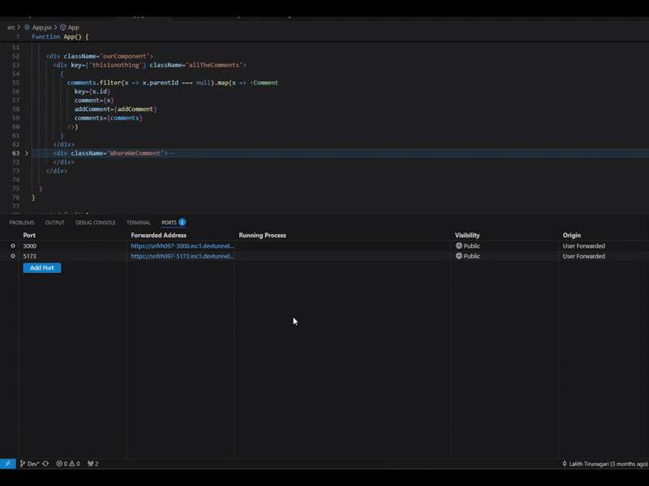

# Recursive component

Recreating reddit comment section where users can comment and reply to each other comments and maintian threads of conversations. 
or a file system where you can create folders and subfolders 

Integrated sockets for real time comments.

here is the link: https://recursive-component-bay.vercel.app/

# steps to host the project locally and connect with other users
- to start the frontend - run "npm install" and npm start.
- to start the backend 
    - cd server
    - npm install
    - npm start
- the project is currently running in localhost.
- By utilizing port forwarding, we can create a link for your global link for backend and frontend.
- in vsCode terminal - ports tab, add your port where frotend(5173) and backend(3000) are running.

- Replace the urls with in your code. (global search "replace your url")
- restart the server and frontend.

